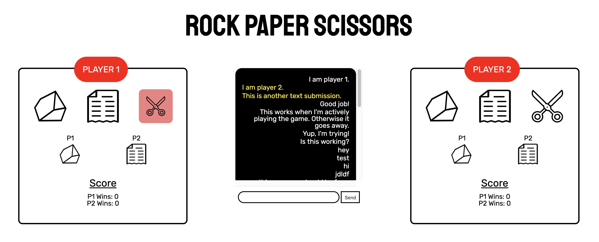

# Multiplayer Rock, Paper, Scissors
The challenge for this optional "reach" project was to create a two-player Rock, Paper, Scissors application. I wasn't able to complete the assignment to the point of a functional game, but I did make decent progress and I'm happy with the front-end design, which is why I've published it. 

## Complete
- The design! I wanted to create a clean, minimal application, complete with a chat application, and I think that comes across. While the functionality is not there yet, I'm proud of the design itself. I hope to get the functionality working in the near future. 
- Firebase connections and various event handlers work fine, including the connections listener. Even though I didn't get the app to work at this stage, I did learn a lot about Firebase.

## Semi-complete
- Players should be identified by the number of open connections. The first tab opened is set to Player 1, while the second tab opened is set to Player 2. When the player selects a one of the three available options, that is registered in Firebase and then displayed on the screen. I got this to work on a number of occassions, but it's not consistent and should be re-visited later. In fact, rather than have the logic of the game dependent on sessions, I'll probably have to do it based on whether someone has signed in or entered their name. 
- Chat functionality is set up and renders based on the player you are (Player 1's text is displayed in white on the left-hand side, while Player 2's text is displayed in yellow on the right-hand side). This works when both players are logged in. I haven't gotten around to having the previously submitted text appear in the proper space prior to load.

## Incomplete
- The game doesn't process user selections behind the scenes and determine a winner (ie, Rock beats Scissors). That's easy enough, but I didn't get there. Wins, as a result, aren't tallied and still sit at zero (they're properly hooked up to Firebase).

## Technologies Used
- JavaScript
- JQuery
- Firebase
- HTML/CSS
